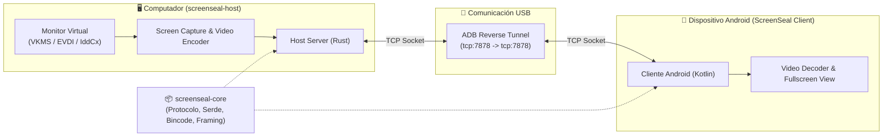

# ScreenSeal 📱🖥️

> Convierte tu dispositivo Android en un segundo monitor extendido real para tu computador a través de conexión USB, sin necesidad de hardware adicional (HDMI, DisplayPort o capturadoras).

---

## 📌 Contexto y Objetivo

**ScreenSeal** nace con la idea de transformar un teléfono o tablet Android en una **segunda pantalla extendida real** del computador mediante cable USB y software.

A diferencia de soluciones convencionales que únicamente duplican o transmiten una ventana:
- El sistema operativo del PC reconoce una **pantalla / monitor virtual adicional**.
- Permite mover y organizar ventanas en el nuevo espacio de trabajo.
- Permite que aplicaciones como **OBS Studio** reconozcan y capturen dicho monitor virtual de forma nativa e independiente.

---

## 👥 Integrantes

- **Diego Darwitg**
- **Iván Carreño**

---

## 🏗️ Arquitectura del Proyecto

El proyecto está modularizado en tres componentes principales:

```
ScreenSeal/
├── Cargo.toml                  # Workspace de Cargo
├── Cargo.lock
├── crates/
│   ├── screenseal-core/        # Lógica y protocolo común (Rust)
│   └── screenseal-host/        # Demonio / Servidor PC (Rust)
├── android/                    # Cliente Android (Kotlin)
└── docs/                       # Documentación
```



### 1. `screenseal-core` (Rust)
Biblioteca compartida encargada de la lógica base entre el host y el cliente:
- Definición de mensajes del protocolo (`Message::Hello`, `Message::HelloAck`).
- Serialización y deserialización binaria con **Serde** y **Bincode 2**.
- Versionado del protocolo de comunicación.
- Estructuras y framing reutilizables.

### 2. `screenseal-host` (Rust)
Programa principal que se ejecuta en el PC:
- Servidor TCP en `127.0.0.1:7878`.
- Detección y gestión de la conexión con el dispositivo Android.
- Creación y administración del monitor virtual en el sistema operativo.
- Captura de pantalla en tiempo real y codificación de frames de video.
- Recepción futura de eventos táctiles e interactividad desde Android.

### 3. `android` (Kotlin)
Aplicación para Android (dispositivos físicos / tablets):
- Conexión al host vía túnel TCP sobre ADB.
- Handshake inicial con el host.
- Decodificación y renderizado de video en pantalla completa con baja latencia.
- Envío de eventos táctiles hacia el PC.

---

## 🔌 Comunicación y Transporte

La comunicación física se realiza a través de cable USB mediante **ADB Reverse**:

```bash
adb reverse tcp:7878 tcp:7878
```

Esto redirige las conexiones locales del dispositivo Android en `127.0.0.1:7878` directamente hacia el puerto `7878` del host en el PC, permitiendo utilizar sockets TCP sobre la capa física USB sin requerir drivers USB personalizados en las etapas iniciales de desarrollo.

### Protocolo de Framing y Handshake

Cada mensaje transmitido por TCP utiliza un prefijo de tamaño de 4 bytes (Big-Endian):
```
┌────────────────────────┬──────────────────────────────────────────┐
│ Tamaño (4 bytes / u32) │ Payload Serializado (Bincode / Serde)   │
└────────────────────────┴──────────────────────────────────────────┘
```

#### Flujo de Handshake Inicial:

```text
HOST (PC)                                   CLIENTE (Android)
  │                                                 │
  │──────────── Message::Hello (version: 1) ───────>│
  │                                                 │
  │<─────────── Message::HelloAck (version: 1) ─────│
  │                                                 │
  └──────────────── Handshake Aceptado ─────────────┘
```

---

## 🗺️ Plan de Desarrollo y Estado del Proyecto

- [x] **Etapa 1 — Comunicación Base**
  - [x] Configuración del Workspace en Rust.
  - [x] Implementación de `screenseal-core` (protocolo y mensajes).
  - [x] Serialización y deserialización con Bincode.
  - [x] Framing TCP (4 bytes de longitud).
  - [x] Servidor TCP en `screenseal-host`.
  - [x] Cliente de pruebas en Rust y verificación de Handshake.
  - [x] Verificación de túnel con `adb reverse`.
  - [ ] Implementación del cliente Android en Kotlin y Handshake Android ↔ Host Rust. *(En curso)*

- [ ] **Etapa 2 — Transmisión de Video**
  - [ ] Definición de mensajes de streaming de video en el protocolo.
  - [ ] Captura de pantalla de monitor virtual en PC.
  - [ ] Codificación de frames en tiempo real.
  - [ ] Streaming de video optimizado por TCP.
  - [ ] Decodificación y renderizado a pantalla completa en Android.

- [ ] **Etapa 3 — Monitor Virtual & Multiplataforma**
  - [ ] **Linux:** Creación de monitor virtual mediante drivers/módulos como **VKMS** o **EVDI**.
  - [ ] **Windows:** Creación de monitor virtual mediante **Indirect Display Driver (IddCx)**.
  - [ ] Soporte para eventos táctiles (Touch input) desde Android hacia el sistema operativo anfitrión.

---

## 🛠️ Tecnologías

| Ámbito | Tecnologías / Herramientas |
| :--- | :--- |
| **PC (Host & Core)** | Rust, Cargo, Tokio / TCP Sockets, Serde, Bincode 2, ADB |
| **Android (Cliente)** | Kotlin, Android SDK, Android Coroutines, Java Sockets |
| **Monitores Virtuales** | Linux (VKMS / EVDI), Windows (IddCx / Indirect Display Driver) |

---

## 🚀 Guía de Inicio Rápido

### Prerrequisitos
- [Rust](https://www.rust-lang.org/) (edición 2024 / última versión estable).
- [Android SDK / Android Studio](https://developer.android.com/studio) y `adb` instalado.
- Dispositivo Android con depuración USB habilitada.

### Comandos de Compilación y Test (Rust)

```bash
# Verificar compilación
cargo check

# Ejecutar tests unitarios de protocolo y serialización
cargo test

# Ejecutar el servidor host
cargo run -p screenseal-host
```

### Configuración de ADB Reverse para Pruebas

```bash
# Verificar dispositivo conectado
adb devices

# Establecer túnel de comunicación TCP
adb reverse tcp:7878 tcp:7878
```

---

## 📄 Licencia

Este proyecto está distribuido bajo la licencia MIT. Consulta el archivo `LICENSE` para más información.
